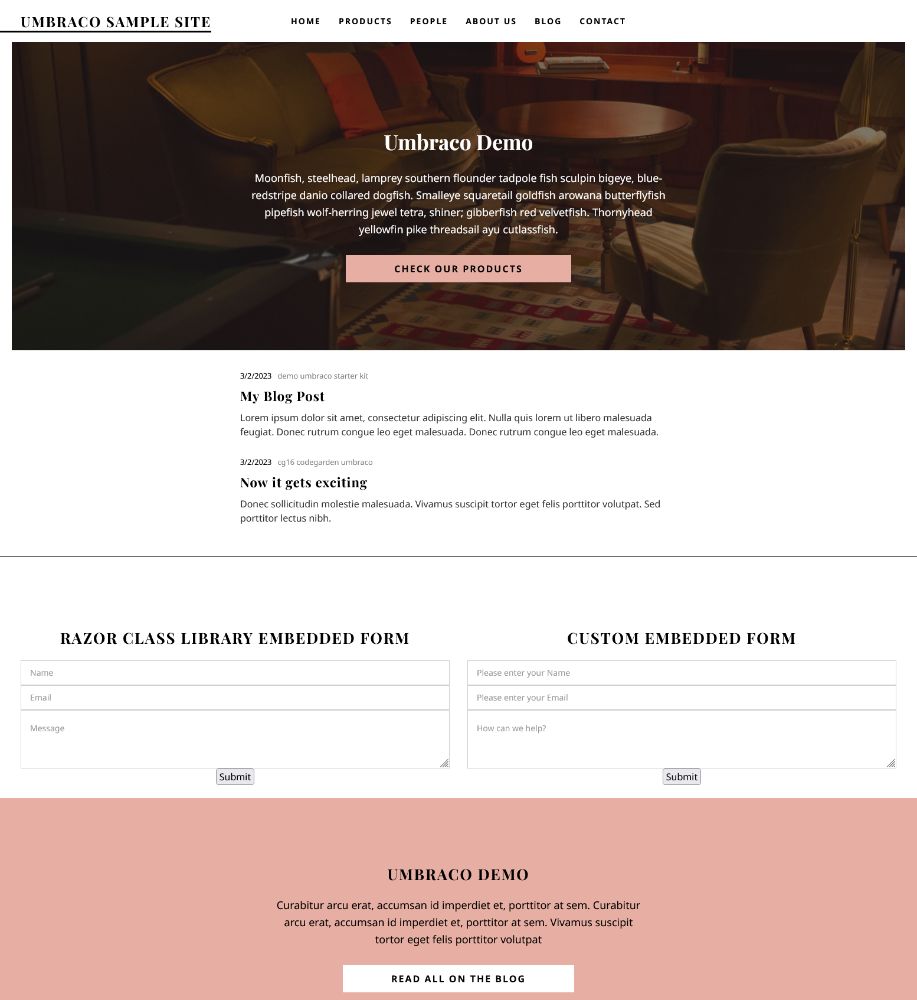

# SimpleForms

A basic contact form project that can be added to any site without requiring any back end development at all. This repo is a temporary location for the project until the full project is ready to be released, at which point it will be made a public repo.

**PLEASE NOTE : Simple Forms is not yet released fully!**

*The source needs to still be cleaned up, and have my keys removed, but it will be and released soon! The Timeline for this is during March 2023**

## Demo Site

This demo site shows how to use the SimpleForms package and how to publish that website to a server. This repo will aim to :

- Explain what the SimpleForms package is
- Use the SimpleForms package to create a contact form on the website
- Demonstrate hosting an Umbraco website on Azure
- Demonstrate using Github Actions to build and deploy the website on Azure

## Getting Started

To create this website I ran the following commands. *Note : as this is a live site, I've removed the password from the command line.*

    # Ensure we have the latest Umbraco templates
    dotnet new -i Umbraco.Templates::10.4.0

    # Create solution/project
    dotnet new sln --name "SimpleForms"
    dotnet new umbraco --force -n "SimpleForms.Web" --friendly-name "Administrator" --email "carl@sargunar.com" --password "XXXXXX" --development-database-type SQLite
    dotnet sln add "SimpleForms.Web"

    # Add SimpleForms and uSync packages. uSync is used to help with deployment of this site, but is not required.
    dotnet add "SimpleForms.Web" package Umbraco.Community.SimpleForms
    dotnet add "SimpleForms.Web" package uSync --version 10.3.2

    dotnet run --project "SimpleForms.Web"
    #Running

This will get you a basic Umbraco website with the SimpleForms package installed. I have also made some changes to the appSettings.json file to configure Modelsbuilder how I prefer to normally set it up.

## Adding a basic contact form

Add the following sippet into your page if you want to use standard contact form built into the package. This is distributed as a partial view, so you won't be able to edit it directly, but you can still style the form using CSS.

    # Add this using statement to the top of your page
    @using Umbraco.Community.SimpleForms.Models;

    # Add this to the body of your page where you want to render the form    
    <section class="section section">
        @{
            await Html.RenderPartialAsync("SimpleFormsContact", new SimpleContactFormViewModel());
        }
    </section>

## Adding a custom contact form

You can also create your own partial view to create a custom contact form layout, and using the SimpleContactFormViewModel to render the form. This is useful if you want to change the layout of the form.

Please Note : you won't be able to add additional fields to this form yet.

### Create the custom Partial

Create a new partial view in the Views folder of your site. I called mine "CustomContactForm.cshtml". Add the following code to the partial view. You can customise this layout as you wish.

    @using Umbraco.Community.SimpleForms.SurfaceControllers
    @using Umbraco.Extensions
    @model Umbraco.Community.SimpleForms.Models.SimpleContactFormViewModel

    @using (Html.BeginUmbracoForm<SimpleFormsSurfaceController>(nameof(SimpleFormsSurfaceController.Submit)))
    {
        

            @Html.TextBoxFor(m => m.Name, new { @class = "form-control", placeholder = Html.DisplayNameFor(m => m.Name) })
            @Html.ValidationMessageFor(m => m.Name)
        

        

            @Html.TextBoxFor(m => m.Email, new { @class = "form-control", placeholder = Html.DisplayNameFor(m => m.Email) })
            @Html.ValidationMessageFor(m => m.Email)
        

        

            @Html.TextAreaFor(m => m.Message, new { @class = "form-control", placeholder = Html.DisplayNameFor(m => m.Message) })
            @Html.ValidationMessageFor(m => m.Message)
        

        <input type="submit" name="Submit" value="Submit" />
    }

### Using the new Custom Form Partial

    # Add this using statement to the top of your page
    @using Umbraco.Community.SimpleForms.Models;

    # Add this to the body of your page where you want to render the form    
    <section class="section section">
        @{
            await Html.RenderPartialAsync("SimpleFormsContact", new SimpleContactFormViewModel());
        }
    </section>

## Using a Tag Helper

There is also a taghelper in development, which will allow you to render the form with a single line. This will be made available soon.

